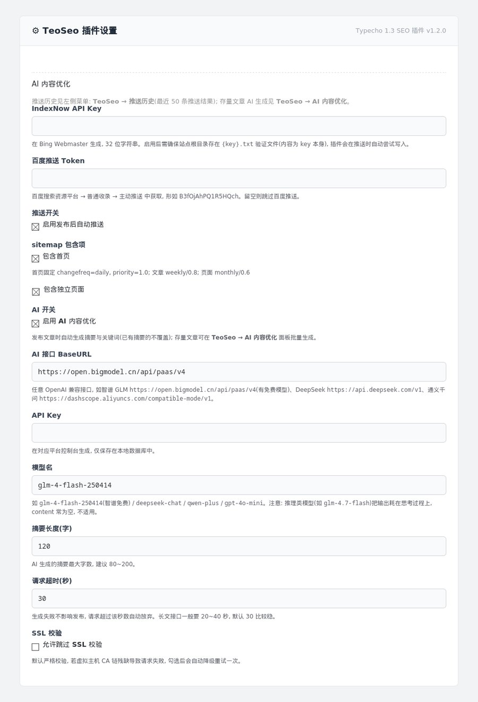
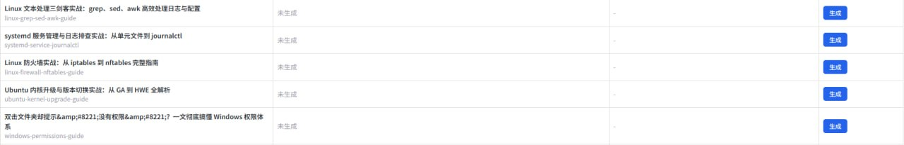
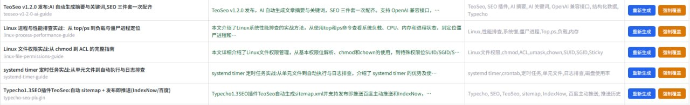
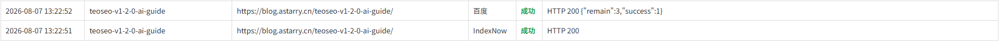

# TeoSeo - Typecho SEO 插件

为 Typecho 提供开箱即用的 SEO 能力,兼容 **Typecho 1.3**(已适配新版接口)。

## 功能

- **自动生成 /sitemap.xml** — 符合 Sitemaps 0.9 协议,动态生成首页 + 全部文章(+ 可选独立页面),URL 走路由表生成,兼容自定义链接格式(如 `/[slug]/`)
- **发布文章自动推送收录**:
  - **IndexNow** — 一次提交,Bing / Yandex / Seznam / Naver / 360 等多平台生效
  - **百度主动推送** — 百度搜索资源平台普通收录
- **手动重新推送**(v1.1.0):后台推送历史面板输入 slug 即可随时补推(发布漏推或文章更新后重新通知搜索引擎)
- **AI 内容优化**(v1.2.0,任意 OpenAI 兼容接口):
  - **发布即生成** — 文章发布时自动调用 AI 生成摘要与关键词,已有摘要不覆盖,失败静默不影响发布
  - **批量生成** — 后台「TeoSeo → AI 内容优化」面板一键处理存量文章,逐篇续跑防超时,失败自动中止防死循环
  - **前台输出** — AI 摘要自动输出为 `meta description` / `meta keywords`,并附带 JSON-LD Article 结构化数据
- 推送失败静默降级(不影响发布流程),无外部依赖,仅需 PHP curl(无 curl 时自动退回流包装器)

## 效果预览

插件设置页:IndexNow / 百度推送 / Sitemap / AI 内容优化(OpenAI 兼容接口)全部集中管理:

后台「AI 内容优化」面板:一键批量生成存量文章摘要与关键词,未生成与已生成的对比:

推送历史面板:每次 IndexNow / 百度推送的成败与响应一目了然:

## 安装

1. 下载并解压,将 `TeoSeo` 目录上传到 `usr/plugins/`
2. 后台 → 插件 → 启用 **TeoSeo**
3. 插件设置中填写:
   - **IndexNow API Key**:在 [Bing Webmaster](https://www.bing.com/webmasters/indexnow) 生成(32 位字符串)。需保证站点根目录存在 `{key}.txt` 验证文件(内容为 key 本身),插件会在推送时自动尝试写入
   - **百度推送 Token**:百度搜索资源平台 → 普通收录 → 主动推送 中获取
   - **AI 接口**(可选,不填则跳过 AI 功能):任意 OpenAI 兼容接口,填写 BaseURL / API Key / 模型名。例如 DeepSeek(`https://api.deepseek.com/v1` + `deepseek-chat`)、通义千问、智谱 GLM 等

## 使用

- sitemap:访问 `https://你的域名/sitemap.xml`,并在 [robots.txt](https://zhuanlan.zhihu.com/p/341513115) 中加入 `Sitemap: https://你的域名/sitemap.xml`
- 推送:正常发布文章即可,无需任何手动操作
- AI 摘要/关键词:发布新文章自动生成;存量文章在后台 **TeoSeo → AI 内容优化** 面板点「批量生成」逐篇处理(每篇一次接口调用,保持页面打开即可,自动跳转直到完成)
- 生成记录:AI 生成结果与推送记录一同写入「推送历史」面板(目标: AI摘要)

## 兼容性

- **Typecho 1.3+**(2026 版,已移除 `Typecho_Plugin_Interface` 全局接口与旧版 `Helper` 全局类,本插件全程使用命名空间版 API:`\Utils\Helper` / `\Typecho\Plugin` / `\Typecho\Widget`)
- PHP 8.x

## 常见问题

**Q: 发布后没有推送?**
- 检查插件设置里 key/token 是否填写、推送开关是否勾选
- 检查站点根目录 `{key}.txt` 是否存在(IndexNow 必需)
- 推送失败会写入 PHP 错误日志(`[TeoSeo]` 前缀)

**Q: sitemap 里没有某篇文章?**
- sitemap 只包含 `status=publish` 且 `type=post` 的内容,草稿/隐藏文章不会出现

**Q: AI 摘要生成失败?**
- 检查设置页 AI 接口 BaseURL / API Key / 模型名是否填写正确
- 确认接口平台账户余额充足、模型名与平台一致
- 失败信息会写入 PHP 错误日志(`[TeoSeo-AI]` 前缀),也会记入「推送历史」面板(目标: AI摘要)

## 相关文章

- [《Typecho1.3SEO插件TeoSeo:自动 sitemap + 发布即推送(IndexNow/百度)》](https://blog.astarry.cn/typecho-seo-plugin/) — 插件开发实录:功能、安装配置、以及给开发者的 Typecho 1.3 插件适配要点(接口变化 / 命名空间 / 面板机制 / 虚拟主机 SSL 坑)
- [《TeoSeo v1.2.0 发布:AI 自动生成摘要与关键词,SEO 三件套一次配齐》](https://blog.astarry.cn/teoseo-v1-2-0-ai-guide/) — AI 内容优化详解:摘要/关键词自动生成、meta/JSON-LD 输出、批量生成面板与上线前修掉的坑

*来自 [Astarry 的技术日记](https://blog.astarry.cn/),记录 Typecho 运维与开源实践。*

## License

GPL-2.0 — 与 Typecho 一致。欢迎 fork、issue、PR。

---

*由 [Astarry](https://blog.astarry.cn) 开发维护,在 blog.astarry.cn 生产环境验证通过。*
